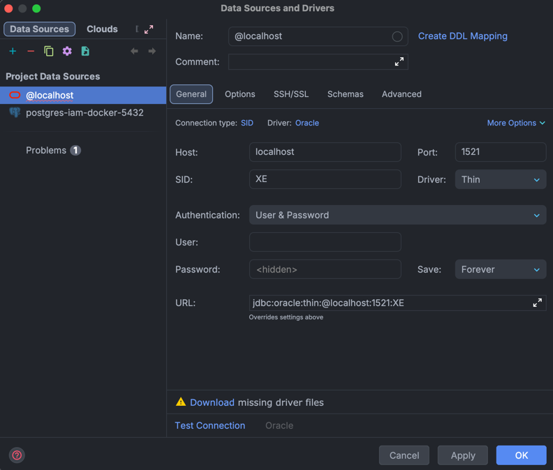
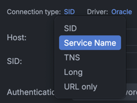
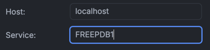
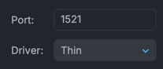
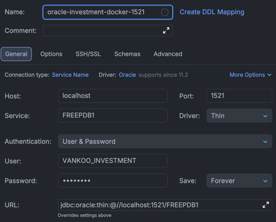
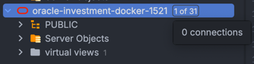

# Conectarse a Oracle Database con Data Source

Como estamos usando la imagen de `gvenzl/oracle-free` con la versión 23, la configuración de la conexión a Oracle Database en DataGrip cambia un poco:

---

1. Cambiamos el Connection type de "SID" a "Service name".

    

2. En el campo "Service name", en lugar de usar el nombre `XE`, usamos el nombre `FREEPDB1`.

    

3. Dejamos activado el driver "Thin", ya que es el driver recomendado para conectarse desde Java.

    

4. El resto de la configuración (host, puerto, usuario, contraseña) se mantiene igual que en la configuración por defecto mostrada en el `README.md`.

    

5. Un detalle importante, es que luego de configurar la conexión, es necesario ir a la pestaña "Schemas" y seleccionar el esquema `VANKOO_INVESTMENT` (si no está activado) para que aparezcan las tablas y demás objetos de la base de datos en el panel lateral de DataGrip.

    

    